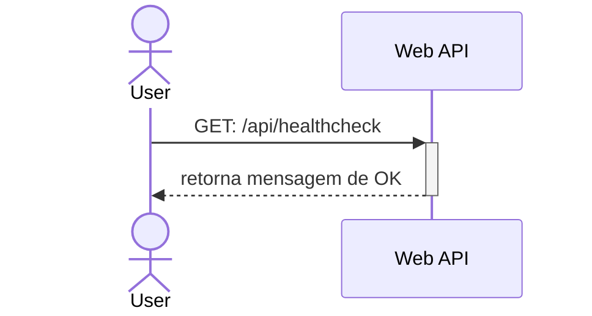

# Healthcheck

O healthchec é um endpoint da API que retorna o estado de saude da aplicação. O utilizador faz um pedido HTTP a um endpoint especifico e recebe uma resposta de sucesso.



O utilizador faz um pedido HTTP `GET: /api/healthcheck` e recebe como resposta a seguinte mensagem em formato `JSON`

```json
{
    "status": "ok"
}
```