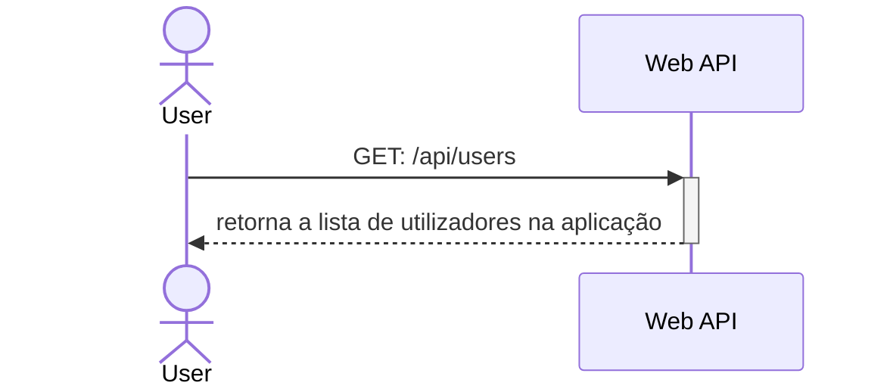
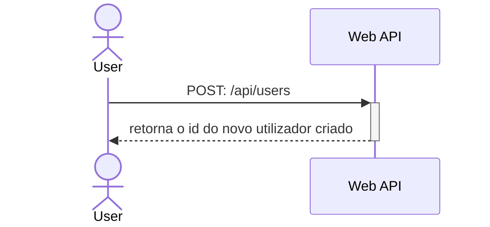

# Getsão de Utilizadores
A gestão de utilizadores serve para que se possam manipular os utilizadores da aplicação sem necessidade de interagir com a base de dados. Este caso de uso divide-se nos casos de uso a baixo

## Listagem de utilizadores
O utilizador pode listar os utilizadores da aplicação



O utilizador faz um pedido HTTP `GET: /api/users` e recebe como resposta uma mensagem em formato `JSON` com o seguinte formato

```json
{
    "users": [
        {
            "id": "24a3c460-d0ef-4b22-bd62-fc3fa3295b67",
            "name": "Maria Amália"
        },
        {
            "id": "903fd3ae-b5ef-47ed-bb6f-5beb86b31c55",
            "name": "Mariza"
        },
        {
            "id": "43e6eeb8-9b4e-4d84-b84c-7e7e974eb283",
            "name": "Camané"
        }
    ]
}
```

## Criação de utilizadores
O utilizador pode criar novos utilizadores da aplicação



O utilizador faz um pedido HTTP `POST: /api/users` com uma mensagem em formato `JSON` com o seguinte formato

```json
{
    "name": "Maria Amália"
}
```

 e recebe como resposta uma mensagem em formato `JSON` com o seguinte formato
 
```json
{
    "result": "success"
}
```