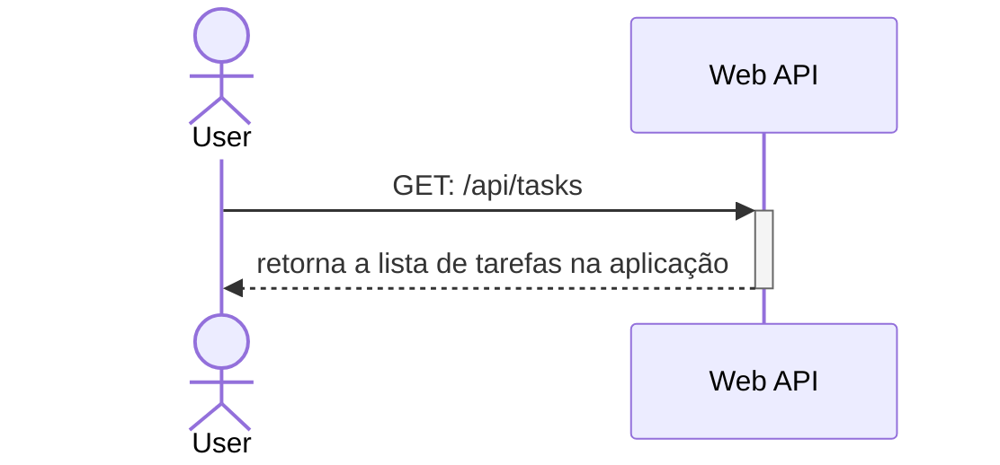
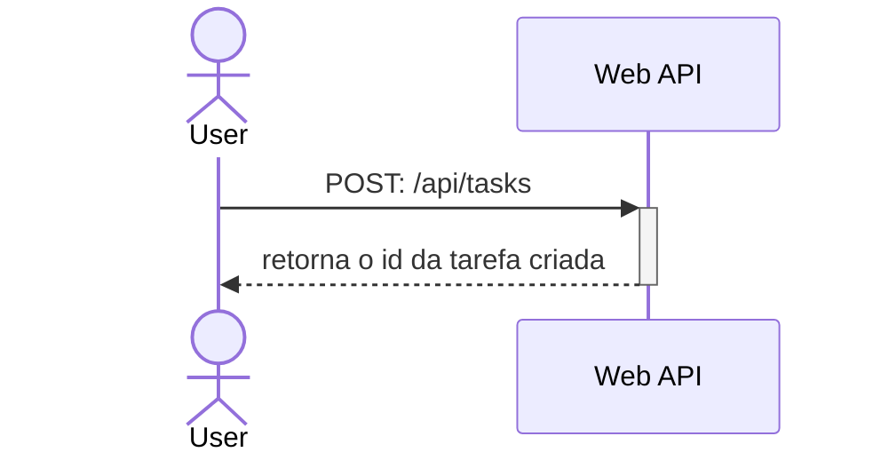
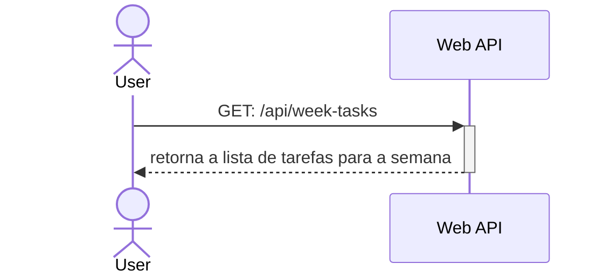
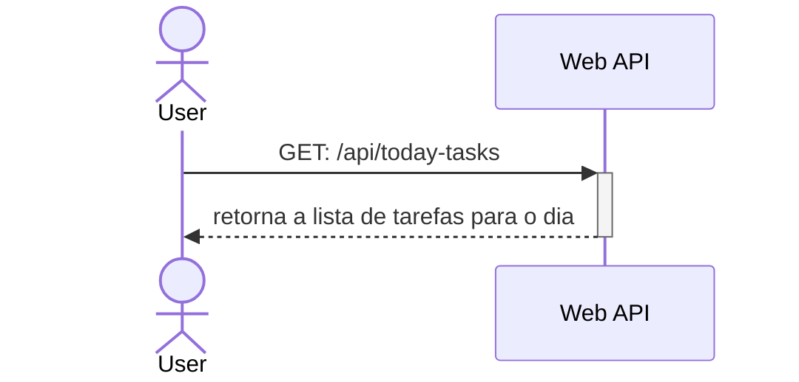
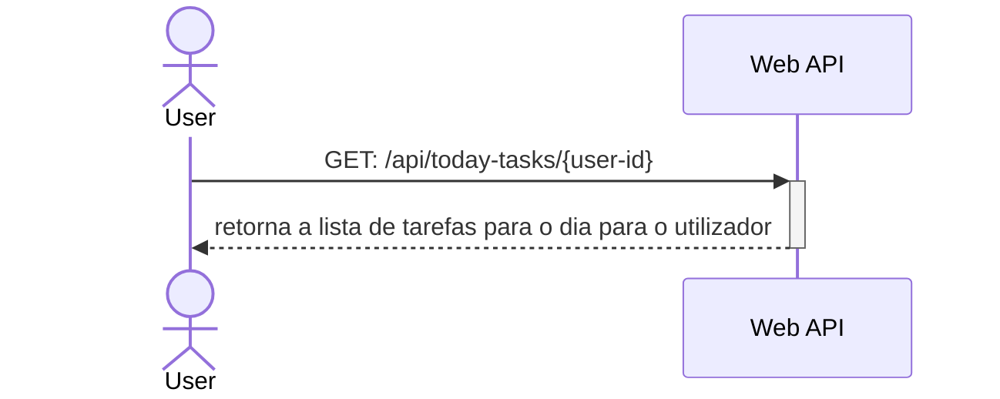

# Getsão de Tarefas
A gestão de tarefas serve para que se possam manipular as tarefas da aplicação sem necessidade de interagir com a base de dados. Este caso de uso divide-se nos casos de uso a baixo

## Listagem das
O utilizador pode listar as tarefas da aplicação



O utilizador faz um pedido HTTP `GET: /api/tasks` e recebe como resposta uma mensagem em formato `JSON` com o seguinte formato

```json
{
    "tasks": [
        {
            "id": "3264c45f-8a4f-40fd-9ba7-c8b6527e8003",
            "description":"Limpar a cozinha",
            "auto-complete": false
        },
        {
            "id": "bc3a285d-e615-4763-bfe5-1a8c45742b11",
            "description":"Levar o lixo",
            "auto-complete": true
        },
        {
            "id": "61dc642e-e971-48fc-bae4-591ac53d2c38",
            "description":"Tirar café",
            "auto-complete": true
        }
    ]
}
```

## Criação de tarefas
O utilizador que seja administrador pode criar novas tarefas da aplicação



O utilizador faz um pedido HTTP `POST: /api/tasks` com uma mensagem em formato `JSON` com o seguinte formato

```json
{
    "description":"Limpar o WC",
    "auto-complete": false
}
```

 e recebe como resposta uma mensagem em formato `JSON` com o seguinte formato

```json
{
    "result": "success"
}
```

## Listagem das tarefas da semana
O utilizador listar as tarefas para a semana



O utilizador faz um pedido HTTP `GET: /api/week-tasks`,  e recebe como resposta uma mensagem em formato `JSON` com o seguinte formato

```json
{
    "sunday": [
        {
            "user":{
                "id": "24a3c460-d0ef-4b22-bd62-fc3fa3295b67",
                "name": "Maria Amália"
            },
            "tasks": [
                {
                "id": "3264c45f-8a4f-40fd-9ba7-c8b6527e8003",
                "description":"Limpar a cozinha",
                },
                {
                    "id": "bc3a285d-e615-4763-bfe5-1a8c45742b11",
                    "description":"Levar o lixo",
                },
                {
                    "id": "61dc642e-e971-48fc-bae4-591ac53d2c38",
                    "description":"Tirar café",
                }
            ]
        }
        
    ],
    ...
}
```
> Independentemente do dia da semana, a listagem vai sempre começar no domingo e apresenta as tarefas agendadas até sábado

## Listagem das tarefas para o dia
O utilizador listar as tarefas para a semana



O utilizador faz um pedido HTTP `GET: /api/today-tasks`,  e recebe como resposta uma mensagem em formato `JSON` com o seguinte formato

```json
[
    {
        "user":{
            "id": "24a3c460-d0ef-4b22-bd62-fc3fa3295b67",
            "name": "Maria Amália"
        },
        "tasks": [
            {
            "id": "3264c45f-8a4f-40fd-9ba7-c8b6527e8003",
            "description":"Limpar a cozinha",
            },
            {
                "id": "bc3a285d-e615-4763-bfe5-1a8c45742b11",
                "description":"Levar o lixo",
            },
            {
                "id": "61dc642e-e971-48fc-bae4-591ac53d2c38",
                "description":"Tirar café",
            }
        ]
    }
    
]
```

**Requisito extra**
Opcionalmente, o utilizador pode adicionar um *query parameter* `date` e a pesquisa deverá ser feita para essa data em especifico. Caso o *query parameter* `date` não seja enviado, deve ser apresentado o pedido para a data atual do sistema

## Listagem das tarefas para o dia para um utilizador
O utilizador listar as tarefas para a semana



O utilizador faz um pedido HTTP `GET: /api/today-tasks/{user-id}`, onde `{user-id}` é o ID do utilizador na base de dados, e recebe como resposta uma mensagem em formato `JSON` com o seguinte formato

```json
{
    "user":{
        "id": "24a3c460-d0ef-4b22-bd62-fc3fa3295b67",
        "name": "Maria Amália"
    },
    "tasks": [
        {
        "id": "3264c45f-8a4f-40fd-9ba7-c8b6527e8003",
        "description":"Limpar a cozinha",
        },
        {
            "id": "bc3a285d-e615-4763-bfe5-1a8c45742b11",
            "description":"Levar o lixo",
        },
        {
            "id": "61dc642e-e971-48fc-bae4-591ac53d2c38",
            "description":"Tirar café",
        }
    ]
}
```

**Requisito extra**
Opcionalmente, o utilizador pode adicionar um *query parameter* `date` e a pesquisa deverá ser feita para essa data em especifico. Caso o *query parameter* `date` não seja enviado, deve ser apresentado o pedido para a data atual do sistema