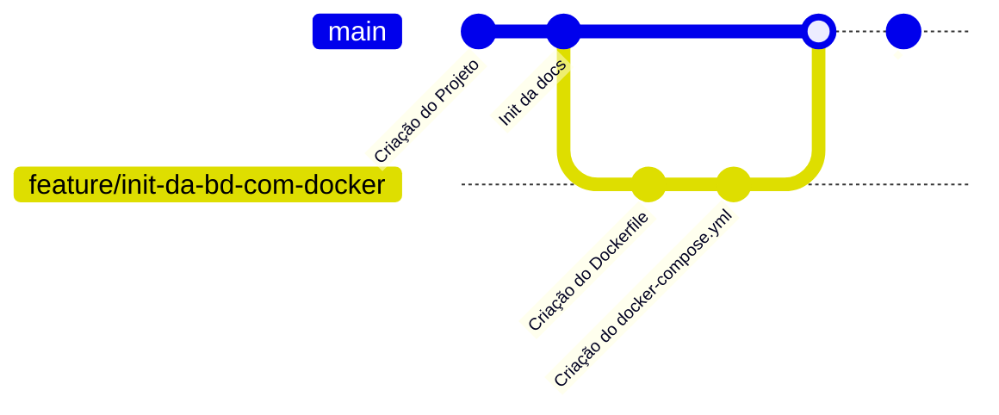

# Documentação
Neste diretório estará disponivel a documentação para o projeto

## Para quê fazer documentação
Fazer documentação é importante para manter o conhecimento sobre o projeto. Nesta fase para se discutir a solução e fazer-se *brainstorming* e no futuro para que seja possivel manter o projeto.

# Organização
O diretório tem um conjunto de pastas que devem ser respeitadas para manter a organização do projeto.
- `Casos de Uso`: Informação sobre os casos de uso que devem ser implementados
- `Implementação`: Informação sobre a implemtação dos casos de uso
    - `Base de Dados`: Informação sobre a configuração do servidor `PostgreSQL`
    - `Web API`: Informação sobre a implemetação da Web API
    - `Web UI`: Informação sobre a implemetação da Web UI
- `Deployment`: Informação sobre o deployment das aplicações tanto em ambiente de desenvolvimento como de produção
- `Templates`: Templates de páginas para utilização

## Criação de outras pastas/ficheiros
Outras pastas e ficheiros podem ser criados mas devem seguir as regras.
- Os ficheiros devem ser colocados nas pastas adquadas
- Os ficheiros de texto devem ser escritos em markdown. Deve ser seguida a [documentação do GitHub](https://docs.github.com/en/get-started/writing-on-github) sobre markdown como referência sobre a linguagem.
- Existem ficheiros de template dentro da pasta `/docs/Templates` que devem ser utilizados para fazer a documentação de certas páginas.
- Ficheiros de anexo, e.g. imagens de mockups ou diagramas, devem ser colocados dentro de uma pasta `_assets` dentro da pasta de documentação a que se refere.  
  E.g. para se fazer o upload de um mock-up para a UI, o ficheiro deve ser colocado dentro da pasta `/docs/Implementação/Web UI/_assets`
  > **Nota:** Ficheiros binários (como imagens, videos, pdf, etc...) devem ser evitados. Devem ser prioritizados ficheiros baseados em texto (código fonte, SVG, etc...) para que possam ser geridos de forma eficiente pelo git

# Planeamento
Todas as tarefas devem ser geridas através do [Quadro Kanban](https://github.com/users/Wultyc/projects/7) no GitHub.

## Implementação das funcionalidades
O processo para a implemetação de uma nova funcionalidade é o seguinte:
- Observa-se as tarefas no [Quadro Kanban](https://github.com/users/Wultyc/projects/7), na coluna "Ready", seleciona-se uma e movemos-la para a coluna "In Progress".
- Cria-se uma branch feature git com o seguinte formato: `feature/<titulo da tarefa>`. O titulo pode ser abreviado do titulo original desde que mantenha o seu significado original (e.g. a tarefa "Inicialização da base de dados com Docker" dar origem à branch `feature/init-da-bd-com-docker`)
- Nessa nova branch deve-se fazer todas as alterações de código necessárias para a tarefa no [Quadro Kanban](https://github.com/users/Wultyc/projects/7), incluindo a documentação
- No final abre-se um Pull Request para o main (ver secção a baixo).
- Coloca-se a tarefa do [Quadro Kanban](https://github.com/users/Wultyc/projects/7) na coluna "In Review" e avança-se para a próxima tarefa
- A tarefa vai ser revista e caso esteja tudo bem é *merged* no branch `main` e a tarefa é movida para a coluna "Done". Caso contrário a tarefa é movida novamente para a "In Progress"

## Git Flow
Git flow é como se chama este processo de criação de branches e merged. Em baixo está a representação gráfica



# Pull Request
O pull request serve para pedir uma revisão antes de ser fazer merge para o branch main. O Pull Request pode ser aberto logo que a funcinalidade esta implementada e a documentação atualizada. Quando se vai abrir o Pull Request, deve-se usar o seguinte formato:

```
# Pull Request
Titulo da Tarefa no Quadro Kanban

# Change Log
- Alterações feitas no código
- Alterações feitas no código
- Alterações feitas no código

# Checklist
- [x] Testei as minhas alterações
- [ ] Atualizei a documentação

# Notas
(Opcional) Notas que o *developer* queira deixar ao *reviwer*
```