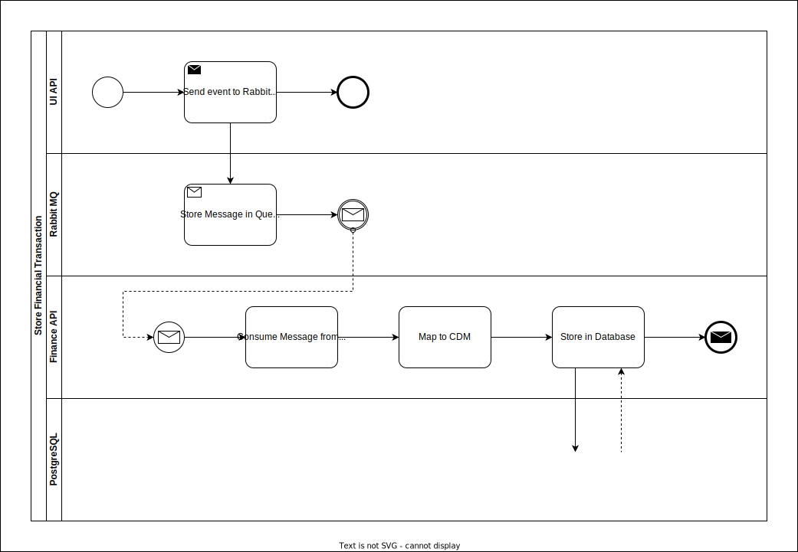

# Store Financial Transaction
Procedure to store financial transaction from UI into the database

|  #  |   System    |            Action             | Description                                         | Details                                                                       |
|:---:|:-----------:|:-----------------------------:| --------------------------------------------------- | ----------------------------------------------------------------------------- |
|  1  |   UI API    |             Start             | Receives request from UI                            |                                                                               |
|  2  |   UI API    |    Send Event to Rabbit MQ    | Sends the received payload to RabbitMQ              | Raw message is publish in a specific queue                                    |
|  3  |  Rabbit MQ  |    Store Message in Queue     | Store message in the queue to be consumed           |                                                                               |
|  4  | Finance API | Consume Message from RabbitMQ | Read the first message in the queue to process      |                                                                               |
|  5  | Finance API |          Map to CDM           | Map the message received into a CDM for further use | The mapping should be done as indicated in [[04. API Endpoint Documentation]] |
|  6  | Finance API |       Store in Database       | Store the message into the PostgreSQL database      |                                                                               |
