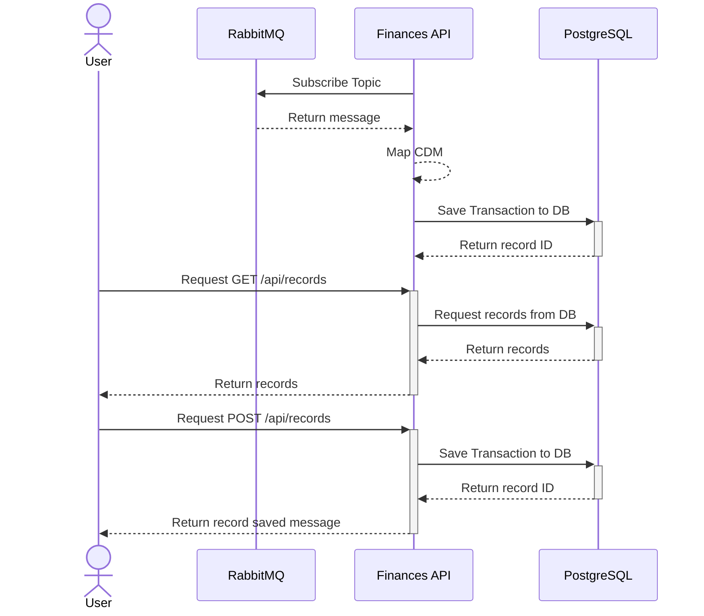

# /api/financial-transaction \[POST\]
Receive an financial transaction and saves it to the database.

## Sequence Diagram

> For maintenance purposes and REST endpoint was made available to insert records manually into the database
## Data Mappings

### URI Params

| Name | Data Type | Description | Comments |
| ---- | --------- | ----------- | -------- |
|      |           |             |          |

### Query Params

| Name | Data Type | Is Mandatory | Description | Comments |
| ---- | --------- | ------------ | ----------- | -------- |
|      |           |              |             |          |

### Request Headers

| Name | Data Type | Is Mandatory | Description | Comments |
| ---- | --------- | ------------ | ----------- | -------- |
|      |           |              |             |          |

### Request Body

| Name | Data Type | Is Mandatory | Description | Comments |
| ---- | --------- | ------------ | ----------- | -------- |
|      |           |              |             |          |

### Response Headers

| Name | Data Type | Is Mandatory | Description | Comments |
| ---- | --------- | ------------ | ----------- | -------- |
|      |           |              |             |          |

### Response Body

| Name | Data Type | Is Mandatory | Description | Comments |
| ---- | --------- | ------------ | ----------- | -------- |
|      |           |              |             |          |

## CDM
[[05. CDM Mapping|Financial Transaction CDM]]

## External Resources

### Rabbit MQ
| Topic / Queue            | User           | Access Type |
| ------------------------ | -------------- |:-----------:|
| `Q.FINANCES.TRANSACTION` | u-finances-api |  Read Only  |

### PostgreSQL
| Database | Table        | User           | Access Type    |
|:-------- |:------------ | -------------- |:---:|
| Finances | Transactions | u-finances-api | Read / Write    |
| Finances | Summary      | u-finances-api | Read Only    |

## Configuration Properties

| Name | Data Type | Description | Comments |
| ---- | --------- | ----------- | -------- |
|      |           |             |          |

## Error Catalog

| Code | Error Message | Description |
| ---- | ------------- | ----------- |
|      |               |             |
